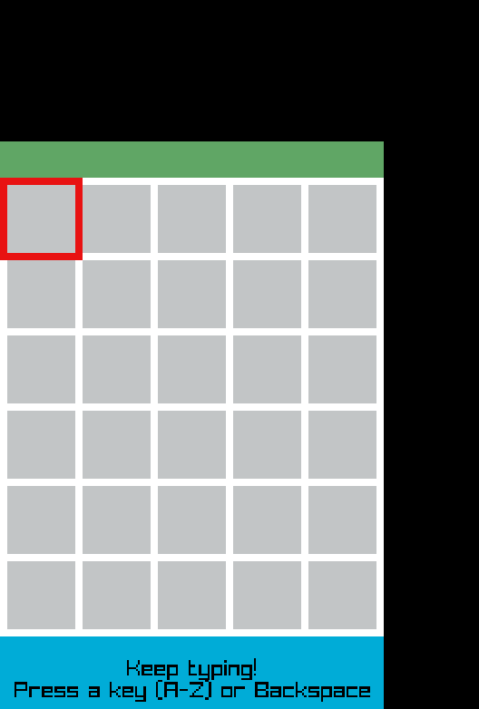

# rs_game_template
A basic template to develop a game using Raylib with rust

## Background Notes
I started to learn Rust and Raylib together. My main language is Golang, but
for game development and other time-critical applications I want to use a
faster language. I tried C, C++, Zig, C3, but at the end I decided to go with Rust.

**Problem:** It took me a while to compile a basic Raylib game with Rust, mainly due to
a toolchain problem.

Hence here below my suggestions to configure a working toolchain for Rust and Raylib.

## Setting the Rust toolchain for Raylib
The suggestions below have been tested by myself and work properly.
I am NOT setting up a cross-compiling toolchain but rather a multi-os
toolchain so that I can clone the repo in a computer running either
operating system, and can obtain a workable binary by simply typing
`cargo build --release`

### Windows
1) Install scoop:
I use the **scoop** package manager for Windows, so that I can have a similar user experience than **brew** (MacOs) and **apt** (Linux).
Follow the installation commands in their Github repo [here](https://github.com/ScoopInstaller/Scoop#installation)
2) Install rust:
From a terminal run the command `scoop install rustup`
3) Setting the default toolchain:
From a terminal run the command `rustup default stable`
4) Install cmake (needed for Raylib build):
From a terminal run the command `scoop install cmake`
5) Install Build Tools for Visual Studio 2022:
Click [this link](https://visualstudio.microsoft.com/downloads/#build-tools-for-visual-studio-2022) to download and install the tools.
6) Install git:
From a terminal run the command `scoop install git`
7) Install VsCode:
From a terminal run the command: `scoop install vscode`
8) Add the following VsCode extensions: 
   - rust-analyzer
   - vscode-icons
   - Even Better TOML
   - CodeLLDB
  

### Linux
T.B.D.

### MacOs
T.B.D.

## Testing the toolchain
Now that you are set, the next step is to clone this repo and test it.
1) Open a terminal and go to your projects folder. If you don't have any I suggest that you create one in **$HOME/Develop**
2) Clone this repo: `git clone https://github.com/flevin58/rs_game_template.git`
3) go inside the repo: `cd rs_game_template`
4) run the app: `cargo run`

You should see this screen:

